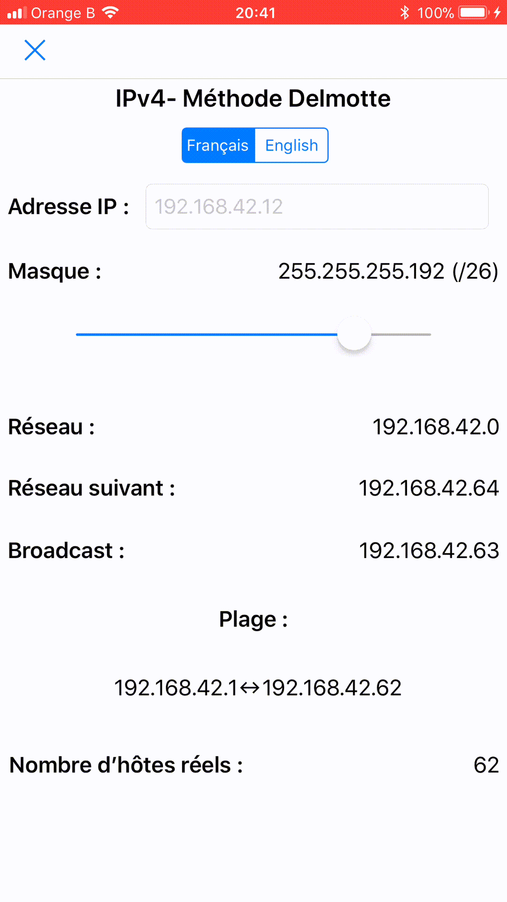

# IPv4- Delmotte
This is a simple implementation of the _Delmotte's method_ used facilitate the creation of an IPv4 addressing.

It has been coded in Python in June 2016 as a Terminal app.  
I decided to update it with a GUI for iOS devices through the [Pythonista app](http://omz-software.com/pythonista/).

---
Here is an preview of the app.  

